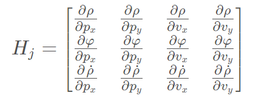

# Extended Kalman Filter 
The goal of this project is to build an Extended Kalman Filter using Modern C++ and
use it to estimate the state i.e. the position and velocity of a moving object of interest with noisy LIDAR
and RADAR measurements. This is a previous udacity project which has been improvised by 
refactoring the code to make use of proper inheritance and use of 
smart pointers to enable for future implementation of any bayesian filter. 
While this demonstrated by implementing Extended Kalman Filter, 
it can be used to implement Unscented Kalman Filter as well.

The measurements data is provided in the form of a [simulator](https://github.com/udacity/self-driving-car-sim/releases).
Download the simulator for the OS you are using.

The key metrics are [RMSE](https://en.wikipedia.org/wiki/Root-mean-square_deviation) values for both position and velocity of the tracked
object.

## LIDAR and RADAR measurements
The lidar measurements are obtained in Cartesian coordinate system (px and py in the image below). Novelocity is obtained from lidar data. Unlike the lidar data, radar data is obtained 
in polar coordinate system. The radar data consists of a directly measured range(i.e. the radial distamce from origin, rho), a bearing angle (i.e. the angle between range and x axis, phi) and range rate (i.e. radial velocity, rho dot).


## Kalman Filter and Extended Kalman Filter
Kalman Filter, in summary, involves a continual loop of State Prediction and Measurement Update functions. In State Prediction step, the algorithm uses the information it has to predict the state (of bicycle around the car, in this case) until the next measurement arrives. In the Measurement Update, a new measurement (from the sensors Lidar/Radar) is used to adjust our belief of the state of the bicycle.
While the Kalman Filter can handle linear motion and measurement, an Extended Kalman Filter can be used to handle nonlinear motion and measurement models. In case of a LIDAR measurement update, we will apply a Kalman Filter because the measurements from the sensor are Linear. But in case of a Radar measurement update, we need to apply Extended Kalman Filter because it includes angles that are nonlinear.
A mathematical equation called Taylor Series (as shown in picture below) is used to get a Linear Approximation of the Non Linear Function.


Since we are interested in linearizing, we just consider the first derivative of Taylor series. The first derivative is implemented thru a Jacobian matrix. The Jacobian for EKF looks like the following:


Which calculates to following:


Equations for Kalman Filter and Extended Kalman Filter are as per the below image:


Notations:
X-State matrix

F-State Transformation Matrix

u-Control variable matrix

P-Process Covariance Matrix (represents error in the estimate/process)

K-Kalman Gain

R-Sensor Noise Covariance Matrix (Measurement Error)

I-Identity matrix

z-Measurement of the state

H-Measurement transition matrix

x’ and P’ are Predicted state and Predicted Process Covariance matrix respectively.

As seen from the image above, Kalman filter equations and extended Kalman filter equations are very similar. The main differences are:
· The F matrix will be replaced by Fj when calculating P’.
· The H matrix in the Kalman filter will be replaced by the Jacobian matrix Hj when calculating S, K, and P.
· To calculate x′, the prediction update function, f, is used instead of the F matrix.
· To calculate y, the h function is used instead of the H matrix.

For this project, however, we do not need to use the f function or Fj. This is because we are using a linear model for the prediction step. So, for the prediction step, we can still use the regular Kalman filter equations and the F matrix rather than the extended Kalman filter equations.
The equation y=z−Hx′ for the Kalman filter does not change to y=z−Hj​x for the extended Kalman filter. Instead, for extended Kalman filters, the equation will be y=z-h (x’); we’ll use the h function directly to convert our Cartesian space to polar space as per the image below:
The angle phi (which is the second value in the h (x’) matrix) needed to be normalized in the y vector so that its angle is between –pi and pi.

## Flow 
The image below shows the flow of the implementation.


## Installation
This repository includes two files that can be used to set up and install [uWebSocketIO](https://github.com/uWebSockets/uWebSockets) for either Linux or Mac systems. For windows you can use either Docker, VMware, or even [Windows 10 Bash on Ubuntu](https://www.howtogeek.com/249966/how-to-install-and-use-the-linux-bash-shell-on-windows-10/) to install uWebSocketIO. Please see [this concept in the classroom](https://classroom.udacity.com/nanodegrees/nd013/parts/40f38239-66b6-46ec-ae68-03afd8a601c8/modules/0949fca6-b379-42af-a919-ee50aa304e6a/lessons/f758c44c-5e40-4e01-93b5-1a82aa4e044f/concepts/16cf4a78-4fc7-49e1-8621-3450ca938b77) for the required version and installation scripts.

## Results
The success metrics for this project are the RMSE values for 2 datasets.
The values should be below:
- `0.11` for `P x` and `P y`.
- `0.52` for `V x` and `V y`.

### RMSE values

The folowing table lists the results of both datasets:

| RMSE | Dataset 1 | Dataset 2 |
|------|-----------|-----------|
| P x  |  0.0974   |  0.0726   |
| P y  |  0.0855   |  0.0965   |
| V x  |  0.4517   |  0.4216   |
| V y  |  0.4404   |  0.4932   |


### Simulator Results

#### Dataset 1


#### Dataset 2


## Implementation

The code skeleton for this project was provided by udacity on [this repo](https://github.com/udacity/CarND-Extended-Kalman-Filter-Project).

The main program in under the `src` directory.
```
.
├── fusion.cpp
├── fusion.h
├── json.hpp
├── bayesian_filter.h
├── bayesian_filter.cpp
├── extended_kalman_filter.cpp
├── extended_kalman_filter.h
├── main.cpp
├── measurement_package.h
├── tools.cpp
└── tools.h
```

- `main.cpp` - reads in data, runs the Kalman filter and calculates RMSE values after each measurement.
- `fusion.cpp` - initializes the filter, calls the `predict` function and the `update` function.
- `bayesian_filter.cpp` - implements `BayesianFilter` to be inherited by any member of family of Bayesian filters.
- `extended_kalman_filter.cpp`- implementation of the child class for `BayesianFilter`. The  `predict` and `update` function for extended kalman filter are implemented here, for both `lidar` and `radar`. 
- `tools.cpp` - tool functions to calculate `RMSE` and the `Jacobian` matrix, used to convert polar to cartesian coordinates.


## Dependencies

* cmake >= 3.5
  * All OSes: [click here for installation instructions](https://cmake.org/install/)
* make >= 4.1 (Linux, Mac), 3.81 (Windows)
  * Linux: make is installed by default on most Linux distros
  * Mac: [install Xcode command line tools to get make](https://developer.apple.com/xcode/features/)
  * Windows: [Click here for installation instructions](http://gnuwin32.sourceforge.net/packages/make.htm)
* gcc/g++ >= 5.4
  * Linux: gcc / g++ is installed by default on most Linux distros
  * Mac: same deal as make - [install Xcode command line tools](https://developer.apple.com/xcode/features/)
  * Windows: recommend using [MinGW](http://www.mingw.org/)

## Build

1. Clone this repo.
2. Make a build directory: `mkdir build && cd build`
3. Compile: `cmake .. && make` 
   * On windows, you may need to run: `cmake .. -G "Unix Makefiles" && make`
4. Run it: `./ExtendedKF `

## Steps to Run the project

0. Make sure all the dependencies are installed
1. Start the simulator
2. Run `./ExtendedKalmanFilter` in `build` folder
3. Select `EKF/UKF` in the simulator


