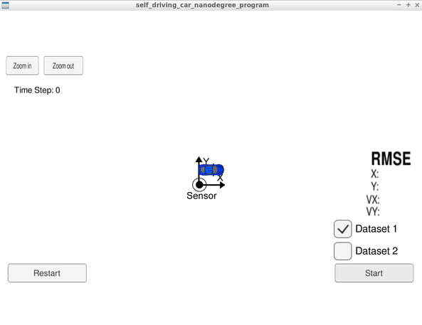
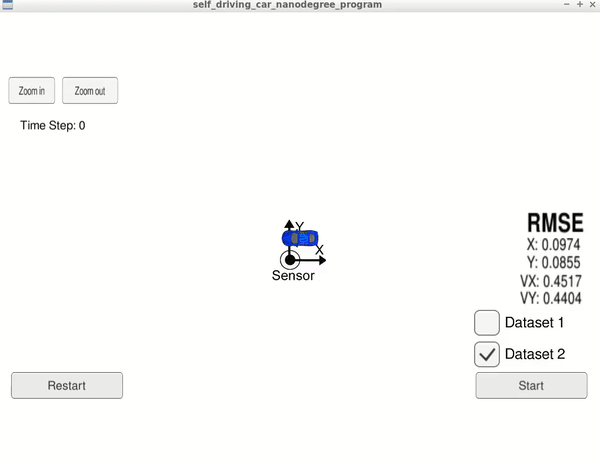

# Capstone Project
The goal of this project is to build an Extended Kalman Filter using Modern C++ and
use it to estimate the state of a moving object of interest with noisy LIDAR
and RADAR measurements. This is a previous udacity project which has been improvised by 
refactoring the code to make use of proper inheritance and use of 
smart pointers to enable for future implementation of any bayesian filter. 
While this demonstrated by implementing Extended Kalman Filter, 
it can be used to implement Unscented Kalman Filter as well.

The measurements data is provided in the form of a [simulator](https://github.com/udacity/self-driving-car-sim/releases).
Download the simulator for the OS you are using.

The key metrics are [RMSE](https://en.wikipedia.org/wiki/Root-mean-square_deviation) values for both position and velocity of the tracked
object.

## Installation
This repository includes two files that can be used to set up and install [uWebSocketIO](https://github.com/uWebSockets/uWebSockets) for either Linux or Mac systems. For windows you can use either Docker, VMware, or even [Windows 10 Bash on Ubuntu](https://www.howtogeek.com/249966/how-to-install-and-use-the-linux-bash-shell-on-windows-10/) to install uWebSocketIO. Please see [this concept in the classroom](https://classroom.udacity.com/nanodegrees/nd013/parts/40f38239-66b6-46ec-ae68-03afd8a601c8/modules/0949fca6-b379-42af-a919-ee50aa304e6a/lessons/f758c44c-5e40-4e01-93b5-1a82aa4e044f/concepts/16cf4a78-4fc7-49e1-8621-3450ca938b77) for the required version and installation scripts.
## Results

The success metrics for this project are the RMSE values for 2 datasets.

The values shoule be below:
- `0.11` for `P x` and `P y`.
- `0.52` for `V x` and `V y`.

### RMSE values

The folowing table lists the results of both datasets:

| RMSE | Dataset 1 | Dataset 2 |
|------|-----------|-----------|
| P x  |  0.0974   |  0.0726   |
| P y  |  0.0855   |  0.0965   |
| V x  |  0.4517   |  0.4216   |
| V y  |  0.4404   |  0.4932   |


### Simulator Results

#### Dataset 1



#### Dataset 2



## Implementation

The code skeleton for this project was provided by udacity on [this repo](https://github.com/udacity/CarND-Extended-Kalman-Filter-Project).

The main program in under the `src` directory.
```
.
├── fusion.cpp
├── fusion.h
├── json.hpp
├── bayesian_filter.h
├── bayesian_filter.cpp
├── extended_kalman_filter.cpp
├── extended_kalman_filter.h
├── main.cpp
├── measurement_package.h
├── tools.cpp
└── tools.h
```

- `main.cpp` - reads in data, runs the Kalman filter and calculates RMSE values after each measurement.
- `fusion.cpp` - initializes the filter, calls the `predict` function and the `update` function.
- `bayesian_filter.cpp` - implements `BayesianFilter` to be inherited by any member of family of Bayesian filters.
- `extended_kalman_filter.cpp`- implementation of the child class for `BayesianFilter`. The  `predict` and `update` function for extended kalman filter are implemented here, for both `lidar` and `radar`. 
- `tools.cpp` - tool functions to calculate `RMSE` and the `Jacobian` matrix, used to convert polar to cartesian coordinates.


## Dependencies

* cmake >= 3.5
  * All OSes: [click here for installation instructions](https://cmake.org/install/)
* make >= 4.1 (Linux, Mac), 3.81 (Windows)
  * Linux: make is installed by default on most Linux distros
  * Mac: [install Xcode command line tools to get make](https://developer.apple.com/xcode/features/)
  * Windows: [Click here for installation instructions](http://gnuwin32.sourceforge.net/packages/make.htm)
* gcc/g++ >= 5.4
  * Linux: gcc / g++ is installed by default on most Linux distros
  * Mac: same deal as make - [install Xcode command line tools](https://developer.apple.com/xcode/features/)
  * Windows: recommend using [MinGW](http://www.mingw.org/)

## Build

1. Clone this repo.
2. Make a build directory: `mkdir build && cd build`
3. Compile: `cmake .. && make` 
   * On windows, you may need to run: `cmake .. -G "Unix Makefiles" && make`
4. Run it: `./ExtendedKF `


## Rubric Criteria and what is satisfied
| Criteria  | Comments |
|-----------|-----------|
|  README   |  Done   |
|  Project Title   |  Done   |
|  Rubric List   |  Done   |
|  Compile and Run   |  Done(Tested with Linux)   |
|  C++ control structures and functions| Done |
|  Reads data from file and processes the data| Done |
|  User Input | Not Required |
|  OOPs| Done |
|  Class access specifiers | Done |
|  Initialization List |  Done |
|  Abstraction | Done |
|  Encapsulation | Done |
|  Inheritance | Done |
|  Derived class override base class member functions | Done |
|  Templates |  Not Required (Future scope) |
|  References in function declaration |  Done |
|  Destructors |  Done |
|  RAII | Done |
|  Rule of 5 | Not Required (No copy constructors) |
|  Move semantics |  Not Required |
|  Smart Pointers |  Done (Shared) |
|  Multi- Threading |  Not Done |
|  Promise and Future |  Not Done |
|  Mutexs or lock | Not Done |
|  Condition Variable | Done |


